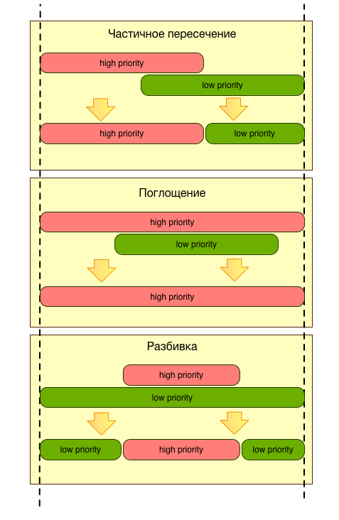

# Тестовое задание "IP-база"

В папке data представлены исходные данные:

- файлы по городам, в которых содержаться блоки ip-адресов принадлежащих городам
- файл cidr_optim.txt с общей базой ip-адресов

Требуется написать программу, которая из исходных данных будет формировать файл с не пересекающимися блоками Российских ip-адресов с указанием принадлежности к городу или России.

## Формат исходных данных

Разделить <TAB>.

Файлы по городам (1-Moscow, 2-Saint-Petersburg,...) имеет следующий формат записи: 

    <начало блока> <конец блока>

где:

- <начало блока> - первый ip адреса в блоке (диапазоне) в формате a.b.c.d
- <конец блока> - последний ip адреса в блоке в формате e.f.g.h

Файл 5-cidr_optim.txt имеет следующий формат записи:

    <начало блока> <конец блока> <блок адресов> <страна>

где: 

- <начало блока> - первый ip адреса в блоке (диапазоне) в виде числа полученного из адреса a.b.c.d
- <конец блока> - последний ip адреса в блоке (диапазоне) в виде числа полученного из адреса e.f.g.h
- <блок адресов> - блок (диапазон) ip-адресов вида a.b.c.d - e.f.g.h
- <страна> - двухбуквенный код страны, к которой относится блок. Нас итересуют блоки с кодом RU.

## Формат выходных данных

В результате работы программы должен быть сформирован файл в следующем формате:

    <начало блока> <конец блока> <география>

- <начало блока> - первый ip адреса в блоке (диапазоне) в формате a.b.c.d
- <конец блока> - последний ip адреса в блоке в формате e.f.g.h
- <география> - принадлежность блока ip-адресов к городу или России: 0 - Россия, 1 - Москва, 2 - С.Петербург, 3 - Екатеринбург, 4 - Новосибирск.

## Правила формирования ip-базы

При слиянии базы, диапазоны ip-адресов представленных в исходных данных могут пересекаться друг с другом, в этом случае приоритетным считается диапазон из файла с меньшим индексом в имени файла, т.е. 1-Moscow.txt имеет самый высокий приоритет, а 5-cidr_optim.txt самый низкий.

### Варианты пересечения

